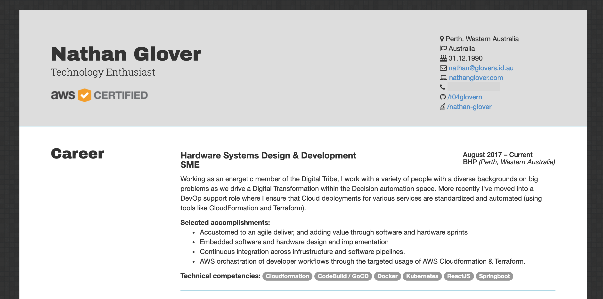

# AWS Amplify Resume



Site can be viewed at [http://aws-amplify-resume-20190216201814-hostingbucket-ampresume.s3-website-us-east-1.amazonaws.com/](http://aws-amplify-resume-20190216201814-hostingbucket-ampresume.s3-website-us-east-1.amazonaws.com/)

## API Schema

```graphql
type Job @model {
  id: ID!
  position: String!
  company: String!
  location: String!
  dates: String!
  summary: String!
  accomplishments: [String]
  competencies: [String]
}

type Detail @model {
  id: ID!
  name: String!
  profession: String!
  location: String
  certified: Boolean!
  citizenship: String
  birthday: String
  email: String
  site: String
  phone: String
  github: String
  stackoverflow: String
}
```

## Instructions

Detailed instructions can be found at [instructions/README.md](instructions/README.md)
