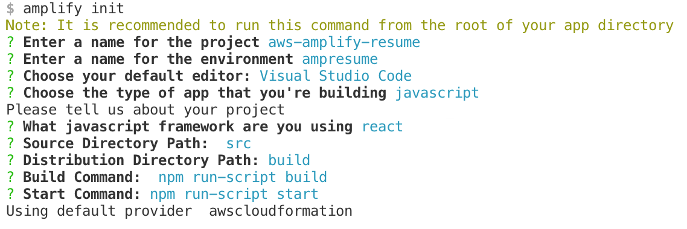
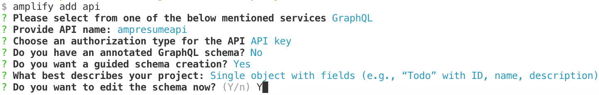
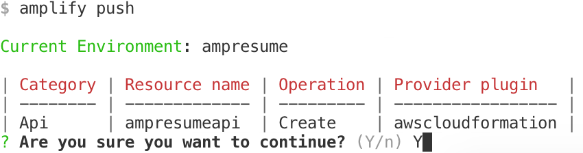
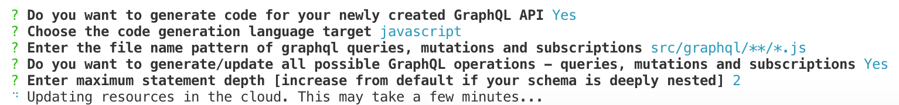
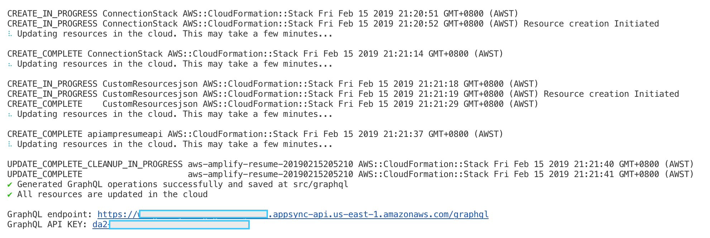
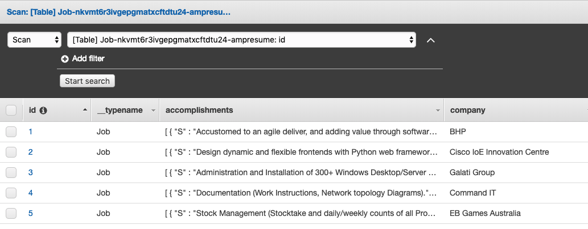
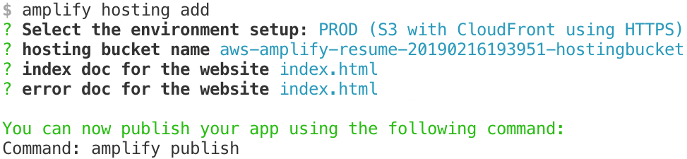

# Setup Project

```bash
npm i -g @aws-amplify/cli
npx create-react-app aws-amplify-resume
cd aws-amplify-resume
amplify init
```



- "amplify status" will show you what you've added already and if it's locally configured or deployed
- "amplify \<category\> add" will allow you to add features like user login or a backend API
- "amplify push" will build all your local backend resources and provision it in the cloud
- "amplify publish" will build all your local backend and frontend resources (if you have hosting category added) and provision it in the cloud

## Add GraphQL endpoint

```bash
amplify add api
```



Created a basic structure for the resume career section

```graphql
type Job @model {
  id: ID!
  position: String!
  company: String!
  location: String!
  dates: String!
  summary: String!
  accomplishments: [String]
  competencies: [String]
}

type Detail @model {
  id: ID!
  name: String!
  profession: String!
  location: String
  certified: Boolean!
  citizenship: String
  birthday: String
  email: String
  site: String
  phone: String
  github: String
  stackoverflow: String
}
```

Push the project to create the DB

```bash
amplify push

## If you update the schema
amplify api gql-compile
amplify push
```







Under src/aws-exports.js you'll find your endpoint and API key already added for you

```json
const awsmobile = {
    "aws_project_region": "us-east-1",
    "aws_appsync_graphqlEndpoint": "https://xxxxxxxxxxxxxxxxxxx.appsync-api.us-east-1.amazonaws.com/graphql",
    "aws_appsync_region": "us-east-1",
    "aws_appsync_authenticationType": "API_KEY",
    "aws_appsync_apiKey": "da2-6rkv7tfouxxxxxxxxxxxxxxx"
};
```

## Project Configuration

Add the Amplify dependencies to your project

```bash
npm install aws-amplify aws-amplify-react
```

Then under index.js import the dependencies at the top of the file

```javascript
// Import the Amplify Libraries and config
import Amplify from '@aws-amplify/core'
import config from './aws-exports'
Amplify.configure(config)
```

## Insert Jobs

Running queries similar to the one below we create 5 jobs via the mutator CreateJob

```graphql
mutation CreateJob {
  createJob(input: {
    id: 1,
    position: "Hardware Systems Design & Development SME",
    company: "BHP",
    location: "Perth, Western Australia",
    dates: "August 2017 – Current",
    summary: "Working as an energetic member of the Digital Tribe, I work with a variety of people with a diverse backgrounds on big problems as we drive a Digital Transformation within the Decision automation space. More recently I've moved into a DevOp support role where I ensure that Cloud deployments for various services are standardized and automated (using tools like CloudFormation and Terraform).",
    accomplishments: [
      "Accustomed to an agile deliver, and adding value through software and hardware sprints",
      "Embedded software and hardware design and implementation",
      "Continuous integration across infrustructure and software pipelines.",
      "AWS orchastration of developer workflows through the targeted usage of AWS Cloudformation & Terraform."
    ]
    competencies: [
      "Cloudformation",
      "CodeBuild / GoCD",
      "Docker",
      "Kubernetes",
      "ReactJS",
      "Springboot"
    ]
  }) {
    id
    position
    company
    location
    dates
    summary
    accomplishments
    competencies
  }
}
```



## Add Hosting

```bash
amplify hosting add
amplify publish
```


